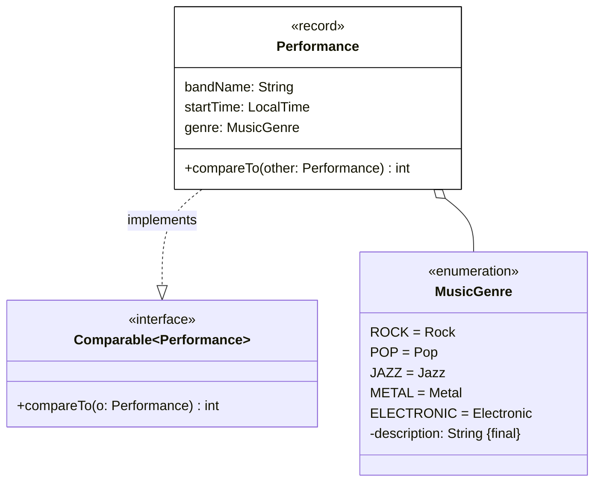
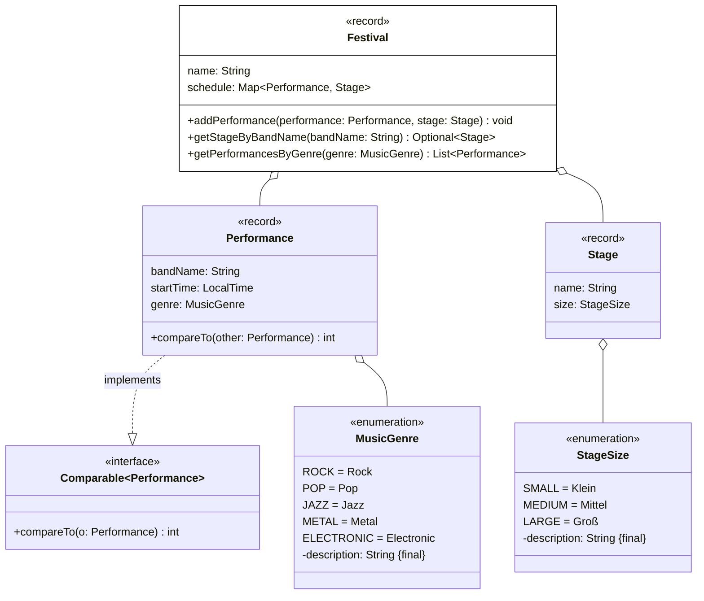

# Wiederholung: Termin 2 - 4

**Beispielklausuraufgabe A1**

Erstelle die Klasse `Performance` anhand des abgebildeten Klassendiagramms (4 Punkte).

_Hinweis_

Die Methode `int compareTo(other: Performance)` soll so implementiert werden, dass Auftritte aufsteigend nach ihrer Startzeit sortiert werden können (2 Punkte).

**Beispielklausuraufgabe A2**

Erstelle die Klasse `Festival` anhand des abgebildeten Klassendiagramms (15,5 Punkte).

_Hinweise_

- Die Schlüssel-Werte-Paare des Assoziativspeichers `schedule` beinhalten als Schlüssel den Auftritt sowie als Wert die zugehörige Bühne
- Die Methode `void addPerformance(performance: Performance, stage: Stage)` soll dem Spielplan das eingehende Auftritt-Bühnen-Paar hinzufügen. Für den Fall, dass der Auftritt bereits im Spielplan vorhanden ist, soll die Ausnahme `DuplicatePerformanceException` ausgelöst werden (4 Punkte)
- Die Methode `Optional<Stage> getStageByBandName(bandName: String)` soll die Bühne zum eingehenden Bandnamen zurückgeben (6 Punkte)
- Die Methode `List<Performance> getPerformancesByGenre(genre: MusicGenre)` soll alle Auftritte zurückgeben, deren Musikgenre dem eingehenden Genre entspricht, aufsteigend sortiert nach ihrer Startzeit (4,5 Punkte)

**Links**

[Solution: ExamTaskA](../../src/main/java/main/X03_ExamTaskA.java)
