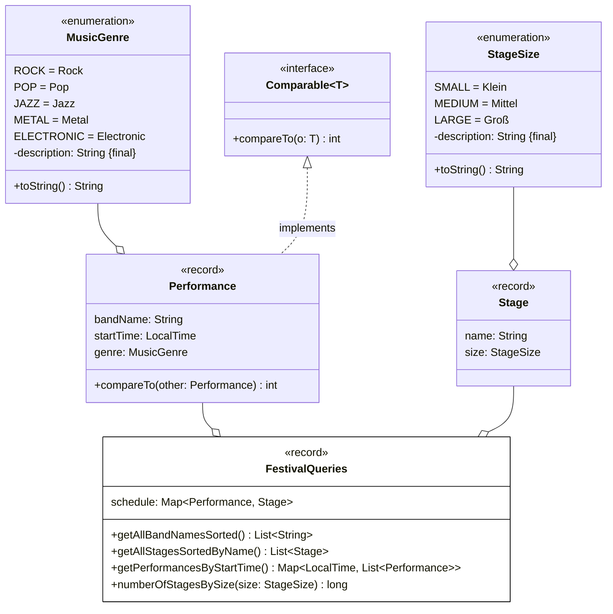

# Wiederholung: Termin 6 - 7

**Beispielklausuraufgabe B**

Erstelle die Klasse `FestivalQueries` anhand des abgebildeten Klassendiagramms.

_Hinweise_

- Die Methode `List<String> getAllBandNamesSorted()` soll die Bandnamen aller Auftritte aufsteigend sortiert zurückgeben (4 Punkte)
- Die Methode `List<Stage> getAllStagesSortedByName()` soll alle Bühnen ohne Dopplungen absteigend sortiert nach ihrem Namen zurückgeben (4 Punkte)
- Die Methode `Map<LocalTime, List<Performance>> getPerformancesByStartTime()` soll alle Auftritte gruppiert nach ihrer Startzeit zurückgeben (3,5 Punkte)
- Die Methode `long numberOfStagesBySize(size: StageSize)` soll die Anzahl der Einträge im Spielplan zurückgeben, bei denen die Bühne die eingehende Bühnengröße besitzt (3,5 Punkte)

_Weitere Collectors-Abfragen_

- Die Methode `Map<MusicGenre, List<String>> getBandNamesByGenre()` soll alle Bandnamen gruppiert nach Musikgenre zurückgeben (_groupingBy_, _mapping_, _toList_) (4,5 Punkte)
- Die Methode `Map<MusicGenre, Long> getNumberOfPerformancesPerGenre()` soll die Anzahl der Auftritte pro Musikgenre zurückgeben (_groupingBy_, _counting_) (3,5 Punkte)
- Die Methode `String getStageNamesBySizeAsString(StageSize size)` soll die Namen aller Bühnen der eingehenden Bühnengröße als kommaseparierte Zeichenkette zurückgeben (_joining_) (5 Punkte)
- Die Methode `Map<Boolean, List<Performance>> partitionPerformancesByTime(LocalTime time)` soll die Auftritte in zwei Gruppen zurückgeben: eine Gruppe mit Auftritten vor der eingehenden Zeit und eine Gruppe mit Auftritten zu oder nach der eingehenden Zeit (_partitioningBy_) (3,5 Punkte)
- Die Methode `Optional<MusicGenre> getMostFrequentGenre()` soll das Musikgenre mit den meisten Auftritten zurückgeben (_groupingBy_, _counting_) (6 Punkte)

**Links**

[Solution: ExamTaskB](../src/main/java/main/X04_ExamTaskB.java)
